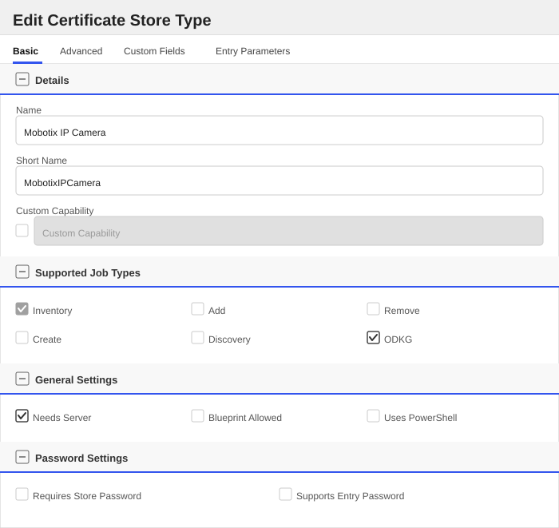
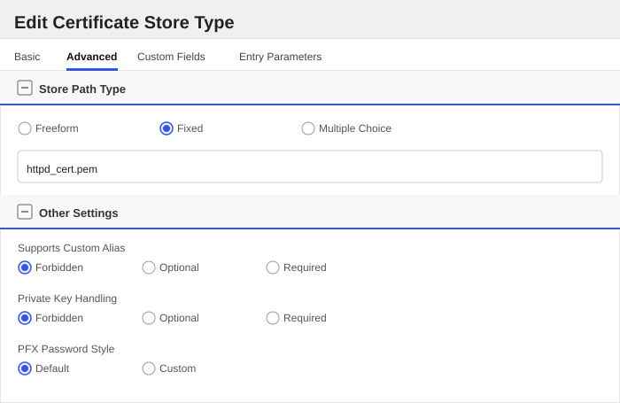
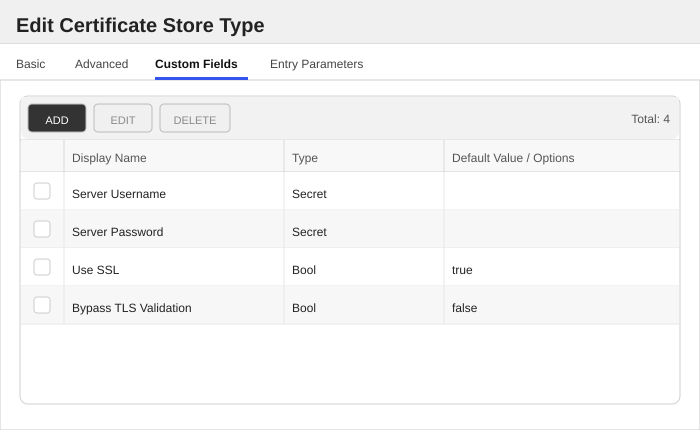
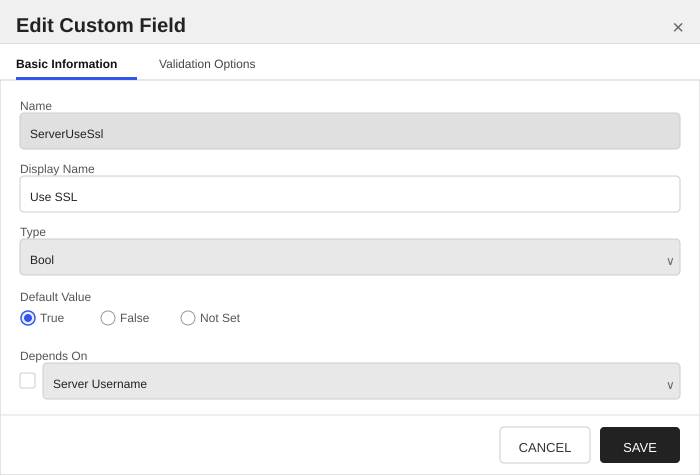
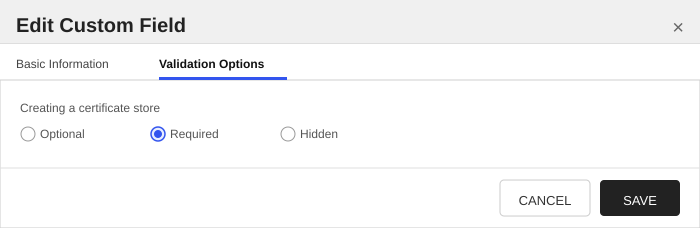
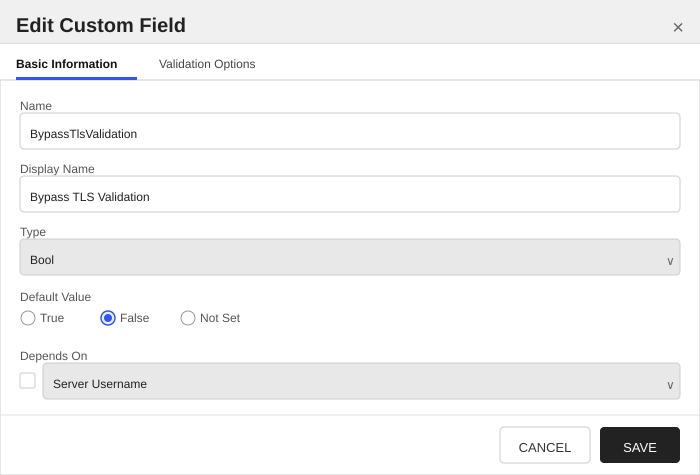

<h1 align="center" style="border-bottom: none">
    Mobotix IP Camera Universal Orchestrator Extension
</h1>

<p align="center">
  <!-- Badges -->

<a href="https://github.com/Keyfactor/mobotix-ipcamera-orchestrator/releases"></a>


</p>

<p align="center">
  <!-- TOC -->
  <a href="#support">
    <b>Support</b>
  </a>
  ·
  <a href="#installation">
    <b>Installation</b>
  </a>
  ·
  <a href="#license">
    <b>License</b>
  </a>
  ·
  <a href="https://github.com/orgs/Keyfactor/repositories?q=orchestrator">
    <b>Related Integrations</b>
  </a>
</p>

## Overview

The Mobotix IP Camera Orchestrator extension remotely manages TLS certificates on Mobotix IP Network Cameras (x7 and x8 models). 

This extension provides functionality to:
- Inventory the TLS certificate used by the camera's web server
- Enroll and install a new TLS certificate for use by the camera's web server

Since Mobotix cameras do not support on-device key generation, the extension performs certificate enrollment by:
1. Generating a private key pair in memory on the orchestrator server
2. Creating and submitting a CSR to Command
3. Receiving the issued certificate
4. Uploading the private key and certificate to the camera via REST API
5. Rebooting the device to apply the new certificate

This job type is still referred to as ODKG (On Device Key Generation) in Keyfactor Command — the platform-wide name for a Reenrollment job — even though for Mobotix the key pair is generated on the orchestrator server rather than on the device itself.

This workflow is fully automated. 

### Use Cases

#### Supported

1. Inventory of TLS certificate (web server only)
2. Automated enrollment and installation of TLS certificates

#### Not Supported

1. Upload of certificates outside the enrollment workflow
2. Removal of certificates from the camera
3. Management (add/remove) of CA certificates on the device

## Compatibility

This integration is compatible with Keyfactor Universal Orchestrator version 25.4 and later.

## Support

The Mobotix IP Camera Universal Orchestrator extension is supported by Keyfactor. If you require support for any issues or have feature request, please open a support ticket by either contacting your Keyfactor representative or via the Keyfactor Support Portal at https://support.keyfactor.com.

> If you want to contribute bug fixes or additional enhancements, use the **[Pull requests](../../pulls)** tab.

## Requirements & Prerequisites

Before installing the Mobotix IP Camera Universal Orchestrator extension, we recommend that you install [kfutil](https://github.com/Keyfactor/kfutil). Kfutil is a command-line tool that simplifies the process of creating store types, installing extensions, and instantiating certificate stores in Keyfactor Command.

1. Out of the box, a Mobotix IP Network Camera will typically have configured an **Administrator** account. It is recommended to create a new account specifically for executing API calls. This account will need \'Administrator\' privileges since the orchestrator extension is capable of making configuration changes, such as enrolling new certificates.
2. Network connectivity from orchestrator to camera over HTTP/HTTPS

### Camera Compatibility

Supported on Mobotix x7 and x8 model cameras (per the Mobotix API).

- **Tested model:** Mobotix v71
- **Tested software version:** MX-V7.3.5.35

Has not been tested with any other model or software version.

### Authentication

The Mobotix IP Camera Orchestrator Extension uses .NET HttpClientHandler credential negotiation when connecting to Mobotix devices over HTTPS, the same mechanism used by the AXIS IP Camera Orchestrator Extension.
This allows the orchestrator to automatically negotiate the authentication mechanism required by the camera.
The orchestrator has been validated against Mobotix cameras configured with:

- Basic
- Digest
- Auto

As a result, customer-side changes to camera authentication policies are generally not required.

## MobotixIPCamera Certificate Store Type

To use the Mobotix IP Camera Universal Orchestrator extension, you **must** create the MobotixIPCamera Certificate Store Type. This only needs to happen _once_ per Keyfactor Command instance.

The Mobotix IP Camera certificate store type represents the TLS configuration of a Mobotix IP network camera, including
the certificate and private key used by the camera's web server.

Only a single TLS certificate can be active on the camera at any time.
Updating the certificate replaces the existing one.
The default certificate installed on the camera is the factory device ID certificate.

#### Mobotix IP Camera Requirements

1. A user Account with \'Administrator\' privileges
2. Camera IP address (and possible port number)

#### Supported Operations

| Operation    | Is Supported |
|--------------|--------------|
| Add          | 🔲 Unchecked |
| Remove       | 🔲 Unchecked |
| Discovery    | 🔲 Unchecked |
| Reenrollment | ✅ Checked |
| Create       | 🔲 Unchecked |

#### Store Type Creation

##### Using kfutil:
`kfutil` is a custom CLI for the Keyfactor Command API and can be used to create certificate store types.
For more information on [kfutil](https://github.com/Keyfactor/kfutil) check out the [docs](https://github.com/Keyfactor/kfutil?tab=readme-ov-file#quickstart)

   <details><summary>Click to expand MobotixIPCamera kfutil details</summary>

   ##### Using online definition from GitHub:
   This will reach out to GitHub and pull the latest store-type definition
   ```shell
   # Mobotix IP Camera
   kfutil store-types create MobotixIPCamera
   ```

   ##### Offline creation using integration-manifest file:
   If required, it is possible to create store types from the [integration-manifest.json](./integration-manifest.json) included in this repo.
   You would first download the [integration-manifest.json](./integration-manifest.json) and then run the following command
   in your offline environment.
   ```shell
   kfutil store-types create --from-file integration-manifest.json
   ```
   </details>

#### Manual Creation
Below are instructions on how to create the MobotixIPCamera store type manually in
the Keyfactor Command Portal

   <details><summary>Click to expand manual MobotixIPCamera details</summary>

   Create a store type called `MobotixIPCamera` with the attributes in the tables below:

   ##### Basic Tab
   | Attribute | Value | Description |
   | --------- | ----- | ----- |
   | Name | Mobotix IP Camera | Display name for the store type (may be customized) |
   | Short Name | MobotixIPCamera | Short display name for the store type |
   | Capability | MobotixIPCamera | Store type name orchestrator will register with. Check the box to allow entry of value |
   | Supports Add | 🔲 Unchecked | Indicates that the Store Type supports Management Add |
   | Supports Remove | 🔲 Unchecked | Indicates that the Store Type supports Management Remove |
   | Supports Discovery | 🔲 Unchecked | Indicates that the Store Type supports Discovery |
   | Supports Reenrollment | ✅ Checked | Indicates that the Store Type supports Reenrollment |
   | Supports Create | 🔲 Unchecked | Indicates that the Store Type supports store creation |
   | Needs Server | ✅ Checked | Determines if a target server name is required when creating store |
   | Blueprint Allowed | 🔲 Unchecked | Determines if store type may be included in an Orchestrator blueprint |
   | Uses PowerShell | 🔲 Unchecked | Determines if underlying implementation is PowerShell |
   | Requires Store Password | 🔲 Unchecked | Enables users to optionally specify a store password when defining a Certificate Store. |
   | Supports Entry Password | 🔲 Unchecked | Determines if an individual entry within a store can have a password. |

   The Basic tab should look like this:

   

   ##### Advanced Tab
   | Attribute | Value | Description |
   | --------- | ----- | ----- |
   | Supports Custom Alias | Forbidden | Determines if an individual entry within a store can have a custom Alias. |
   | Private Key Handling | Forbidden | This determines if Keyfactor can send the private key associated with a certificate to the store. |
   | PFX Password Style | Default | 'Default' - PFX password is randomly generated, 'Custom' - PFX password may be specified when the enrollment job is created (Requires the Allow Custom Password application setting to be enabled.) |

   The Advanced tab should look like this:

   

   > For Keyfactor **Command versions 24.4 and later**, a Certificate Format dropdown is available with PFX and PEM options. Ensure that **PFX** is selected, as this determines the format of new and renewed certificates sent to the Orchestrator during a Management job. Currently, all Keyfactor-supported Orchestrator extensions support only PFX.

   ##### Custom Fields Tab
   Custom fields operate at the certificate store level and are used to control how the orchestrator connects to the remote target server containing the certificate store to be managed. The following custom fields should be added to the store type:

   | Name | Display Name | Description | Type | Default Value/Options | Required |
   | ---- | ------------ | ---- | --------------------- | -------- | ----------- |
   | ServerUsername | Server Username | Enter the username of the configured "service" user on the camera | Secret |  | ✅ Checked |
   | ServerPassword | Server Password | Enter the password of the configured "service" user on the camera | Secret |  | ✅ Checked |
   | ServerUseSsl | Use SSL | Select True or False depending on if SSL (HTTPS) should be used to communicate with the camera. | Bool | true | ✅ Checked |
   | BypassTlsValidation | Bypass TLS Validation | If true and 'Use SSL' is enabled, TLS certificate validation is skipped when connecting to the camera. Has no effect when 'Use SSL' is false. Only enable this when the camera's certificate cannot be trusted by the orchestrator server. | Bool | false | ✅ Checked |

   The Custom Fields tab should look like this:

   

   ###### Server Username
   Enter the username of the configured "service" user on the camera


   > [!IMPORTANT]
   > This field is created by the `Needs Server` on the Basic tab, do not create this field manually.


   ###### Server Password
   Enter the password of the configured "service" user on the camera


   > [!IMPORTANT]
   > This field is created by the `Needs Server` on the Basic tab, do not create this field manually.


   ###### Use SSL
   Select True or False depending on if SSL (HTTPS) should be used to communicate with the camera.

   
   


   ###### Bypass TLS Validation
   If true and 'Use SSL' is enabled, TLS certificate validation is skipped when connecting to the camera. Has no effect when 'Use SSL' is false. Only enable this when the camera's certificate cannot be trusted by the orchestrator server.

   
   


   </details>

## Installation

1. **Download the latest Mobotix IP Camera Universal Orchestrator extension from GitHub.**

    Navigate to the [Mobotix IP Camera Universal Orchestrator extension GitHub version page](https://github.com/Keyfactor/mobotix-ipcamera-orchestrator/releases/latest). Refer to the compatibility matrix below to determine which asset should be downloaded. Then, click the corresponding asset to download the zip archive.

   | Universal Orchestrator Version | Latest .NET version installed on the Universal Orchestrator server | `rollForward` condition in `Orchestrator.runtimeconfig.json` | `mobotix-ipcamera-orchestrator` .NET version to download |
   | --------- | ----------- | ----------- | ----------- |
   | Between `11.0.0` and `11.5.1` (inclusive) | `net8.0` | `LatestMajor` | `net8.0` |
   | `11.6` _and_ newer | `net8.0` | | `net8.0` |
   | `25.5` _and_ newer | `net10.0` | | `net10.0` |

    Unzip the archive containing extension assemblies to a known location.

    > **Note** If you don't see an asset with a corresponding .NET version, you should always assume that it was compiled for `net10.0`.

2. **Locate the Universal Orchestrator extensions directory.**

    * **Default on Windows** - `C:\Program Files\Keyfactor\Keyfactor Orchestrator\extensions`
    * **Default on Linux** - `/opt/keyfactor/orchestrator/extensions`

3. **Create a new directory for the Mobotix IP Camera Universal Orchestrator extension inside the extensions directory.**

    Create a new directory called `mobotix-ipcamera-orchestrator`.
    > The directory name does not need to match any names used elsewhere; it just has to be unique within the extensions directory.

4. **Copy the contents of the downloaded and unzipped assemblies from __step 2__ to the `mobotix-ipcamera-orchestrator` directory.**

5. **Restart the Universal Orchestrator service.**

    Refer to [Starting/Restarting the Universal Orchestrator service](https://software.keyfactor.com/Core-OnPrem/Current/Content/InstallingAgents/NetCoreOrchestrator/StarttheService.htm).

6. **(optional) PAM Integration**

    The Mobotix IP Camera Universal Orchestrator extension is compatible with all supported Keyfactor PAM extensions to resolve PAM-eligible secrets. PAM extensions running on Universal Orchestrators enable secure retrieval of secrets from a connected PAM provider.

    To configure a PAM provider, [reference the Keyfactor Integration Catalog](https://keyfactor.github.io/integrations-catalog/content/pam) to select an extension and follow the associated instructions to install it on the Universal Orchestrator (remote).

> The above installation steps can be supplemented by the [official Command documentation](https://software.keyfactor.com/Core-OnPrem/Current/Content/InstallingAgents/NetCoreOrchestrator/CustomExtensions.htm?Highlight=extensions).

## Defining Certificate Stores

### Store Creation

#### Manually with the Command UI

<details><summary>Click to expand details</summary>

1. **Navigate to the _Certificate Stores_ page in Keyfactor Command.**

    Log into Keyfactor Command, toggle the _Locations_ dropdown, and click _Certificate Stores_.

2. **Add a Certificate Store.**

    Click the Add button to add a new Certificate Store. Use the table below to populate the **Attributes** in the **Add** form.

   | Attribute | Description |
   | --------- | ----------- |
   | Category | Select "Mobotix IP Camera" or the customized certificate store name from the previous step. |
   | Container | Optional container to associate certificate store with. |
   | Client Machine | The IP address of the Camera. Sample is "192.167.231.174:44444". Include the port if necessary. |
   | Store Path | Not currently used for anything. Can leave blank. |
   | Orchestrator | Select an approved orchestrator capable of managing `MobotixIPCamera` certificates. Specifically, one with the `MobotixIPCamera` capability. |
   | ServerUsername | Enter the username of the configured "service" user on the camera |
   | ServerPassword | Enter the password of the configured "service" user on the camera |
   | ServerUseSsl | Select True or False depending on if SSL (HTTPS) should be used to communicate with the camera. |
   | BypassTlsValidation | If true and 'Use SSL' is enabled, TLS certificate validation is skipped when connecting to the camera. Has no effect when 'Use SSL' is false. Only enable this when the camera's certificate cannot be trusted by the orchestrator server. |

</details>

#### Using kfutil CLI

<details><summary>Click to expand details</summary>

1. **Generate a CSV template for the MobotixIPCamera certificate store**

    ```shell
    kfutil stores import generate-template --store-type-name MobotixIPCamera --outpath MobotixIPCamera.csv
    ```
2. **Populate the generated CSV file**

    Open the CSV file, and reference the table below to populate parameters for each **Attribute**.

   | Attribute | Description |
   | --------- | ----------- |
   | Category | Select "Mobotix IP Camera" or the customized certificate store name from the previous step. |
   | Container | Optional container to associate certificate store with. |
   | Client Machine | The IP address of the Camera. Sample is "192.167.231.174:44444". Include the port if necessary. |
   | Store Path | Not currently used for anything. Can leave blank. |
   | Orchestrator | Select an approved orchestrator capable of managing `MobotixIPCamera` certificates. Specifically, one with the `MobotixIPCamera` capability. |
   | Properties.ServerUsername | Enter the username of the configured "service" user on the camera |
   | Properties.ServerPassword | Enter the password of the configured "service" user on the camera |
   | Properties.ServerUseSsl | Select True or False depending on if SSL (HTTPS) should be used to communicate with the camera. |
   | Properties.BypassTlsValidation | If true and 'Use SSL' is enabled, TLS certificate validation is skipped when connecting to the camera. Has no effect when 'Use SSL' is false. Only enable this when the camera's certificate cannot be trusted by the orchestrator server. |

3. **Import the CSV file to create the certificate stores**

    ```shell
    kfutil stores import csv --store-type-name MobotixIPCamera --file MobotixIPCamera.csv
    ```

</details>

#### PAM Provider Eligible Fields
<details><summary>Attributes eligible for retrieval by a PAM Provider on the Universal Orchestrator</summary>

If a PAM provider was installed _on the Universal Orchestrator_ in the [Installation](#Installation) section, the following parameters can be configured for retrieval _on the Universal Orchestrator_.

   | Attribute | Description |
   | --------- | ----------- |
   | ServerUsername | Enter the username of the configured "service" user on the camera |
   | ServerPassword | Enter the password of the configured "service" user on the camera |

Please refer to the **Universal Orchestrator (remote)** usage section ([PAM providers on the Keyfactor Integration Catalog](https://keyfactor.github.io/integrations-catalog/content/pam)) for your selected PAM provider for instructions on how to load attributes orchestrator-side.
> Any secret can be rendered by a PAM provider _installed on the Keyfactor Command server_. The above parameters are specific to attributes that can be fetched by an installed PAM provider running on the Universal Orchestrator server itself.

</details>

> The content in this section can be supplemented by the [official Command documentation](https://software.keyfactor.com/Core-OnPrem/Current/Content/ReferenceGuide/Certificate%20Stores.htm?Highlight=certificate%20store).


## Device Onboarding

Cameras are typically provisioned with a self-signed or otherwise untrusted device identity certificate.

The **Use SSL** certificate store property controls whether the orchestrator connects to the camera over HTTP or
HTTPS:

- If **Use SSL** is disabled, the orchestrator connects over plain HTTP. There is no TLS handshake, so
  certificate trust does not apply, and **Bypass TLS Validation** has no effect.
- If **Use SSL** is enabled, the orchestrator connects over HTTPS and, by default, validates the camera's
  certificate like any other TLS connection - denying the operation if the certificate is not trusted.

> [!WARNING]
> It is highly recommended to keep **Use SSL** enabled. Plain HTTP sends credentials and certificate data to
> the camera unencrypted, and is only intended as a fallback for cameras or networks that cannot support HTTPS.

To connect successfully over HTTPS when the camera's certificate is untrusted, either:

- Install the certificate's issuing intermediate and root CAs into the orchestrator server's local trust store
  so that standard TLS validation succeeds, or
- Enable the **Bypass TLS Validation** certificate store property (see the store type documentation) to skip
  TLS validation.

This trust requirement is not limited to the camera's initial factory certificate. Once a certificate issued by
the customer's own PKI has been enrolled onto the camera, subsequent connections are validated against that
certificate the same way - so the customer PKI's issuing intermediate and root CAs must also be installed in
the orchestrator server's local trust store, unless **Bypass TLS Validation** is used instead.

> [!IMPORTANT]
> Inventory and Reenrollment (ODKG) jobs both connect to the camera using the same HTTP/HTTPS connection, so
> **Bypass TLS Validation** affects both job types.

## Enrollment Behavior

The following enrollment behaviors are specific to Mobotix cameras and should be considered when designing certificate automation workflows.

### Single Certificate Replacement

Mobotix devices support only a single TLS server certificate for the camera's web server, and the integration manages only that certificate — no others on the device are in scope. Every ODKG job replaces it at the same fixed location and reboots the device to apply the change.

#### Configuration Example

A typical ODKG job configuration for a Mobotix certificate store:

- **Store Path:** `httpd_cert.pem` *(automatically set by the store type configuration)*
- **Overwrite:** `true` or `false` *(has no effect)*
- **Alias:** *(only shown if Overwrite is checked; has no effect)*

In this configuration:
- The ODKG job generates a new certificate and private key
- They are uploaded to the camera's fixed certificate location (`httpd_cert.pem`), replacing the previous certificate
- The device reboots, after which the new certificate becomes active and is the certificate presented in subsequent TLS sessions with the camera's web server

Operational behavior:
- The **Overwrite** and **Alias** fields have no effect — there is only one certificate slot on the device, and every job always replaces it, regardless of these settings
- **Store Path** is fixed to `httpd_cert.pem` by the store type configuration; the integration does not use this value, but it identifies which certificate file is being tracked

> [!IMPORTANT]
> The camera may take several minutes to reboot and become reachable again. During this time, API calls (such as Inventory jobs) will fail because the device is temporarily unavailable.

> [!TIP]
> Wait for the camera to fully come back online before initiating additional jobs, such as Inventory or ODKG.

### Subject Alternative Names (SANs)

As of Keyfactor Command v25.4, Subject Alternative Names (SANs) can be specified for ODKG jobs. Support for passing SANs to the orchestrator also requires, at minimum, Keyfactor Universal Orchestrator v25.1.

The Mobotix API only supports DNS and IP SAN types. Any other SAN types included in the ODKG job will be ignored and will not be added to the enrolled certificate. SANs are not automatically added if none are supplied.

## Troubleshooting

_No known troubleshooting guidance available at this time._

## Operational Notes

_No known operational limitations or version-specific notes at this time._

## Release Notes

**1.0.0**
- Improved HTTP communication diagnostics to improve troubleshooting of camera connectivity and communication issues.
- Updated ODKG job initialization to align with the other jobs.
- Removed an unnecessary dependency path that could prevent the ODKG job loading in certain environments.
- Added support for PAM credential retrieval.
- Initial Public Version.

## License

Apache License 2.0, see [LICENSE](LICENSE).

## Related Integrations

See all [Keyfactor Universal Orchestrator extensions](https://github.com/orgs/Keyfactor/repositories?q=orchestrator).
